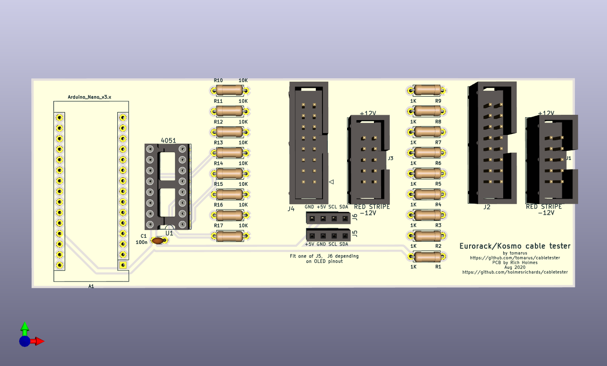

Arduino 10/16 pin Eurorack IDC Power Cable Tester
=================================================

Forked from [https://github.com/tomarus/cabletester](https://github.com/tomarus/cabletester) with slight modifications to circuit and software (mainly order of connections), and with PCB layout added.

* It only tests (max) 8 wires because of how they're wired in eurorack.
* It can detect shorted cables or faulty/unconnected wires.

This project uses a 128x64 OLED I2C display module with four interface pins: GND, +12V, SCL, and SDA. It is a monochrome display although it is available in a version with a yellow and blue overlay as seen in the photos. These modules are available from the "usual suspects" on Amazon, eBay, AliExpress, etc. They do *not* seem to be available from any established vendors like Mouser, DigiKey, Adafruit, or SparkFun. Please make sure you have a source for the display before proceeding with this project! Note that the pinout sometimes is GND-VCC-SCL-SDA and sometimes VCC-GND-SCL-SDA. The initial run of boards assumed the latter pinout; the present design has footprints for both.

# Schematics

# PCB

