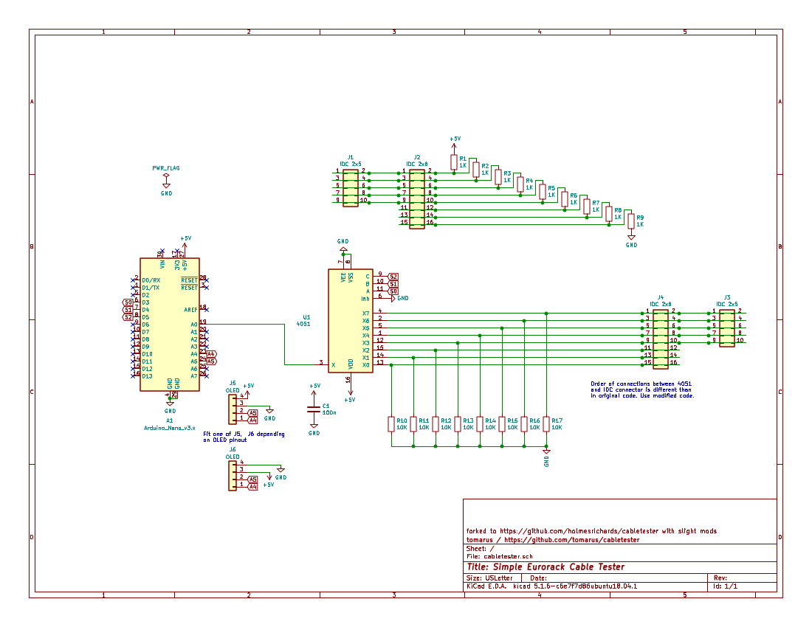

Arduino 10/16 pin Eurorack IDC Power Cable Tester
=================================================

Forked from [https://github.com/tomarus/cabletester](https://github.com/tomarus/cabletester) with slight modifications to circuit and software (mainly order of connections), and with PCB layout added.

* It only tests (max) 8 wires because of how they're wired in eurorack.
* It can detect shorted cables or faulty/unconnected wires.

# Schematics

